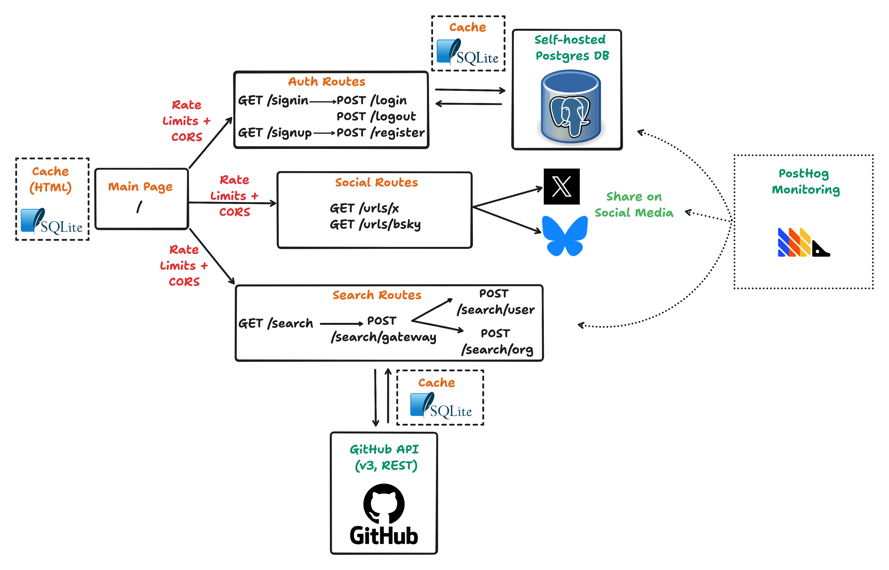

# What A Git Year!

Inspired by [my first project](https://github.com/AstraBert/what-a-git-year), I decided to refactor it as a Go web app just in time for the end-of-the-year season of 2025!

## Stack

- [fiber](https://fibergo.io) - an Express-like Go backend framework based on FastHTTP
- [templ](https://templ.guide) - HTML templating for Go
- [DaisyUI](https://daisyui.com) and [TailwindCSS](https://tailwindcss.com) - Beautiful frontend components and styling
- [htmx](https://htmx.org) - Communication between frontend and backend
- [AlpineJS](https://alpinejs.dev) - Dynamic local rendering of some components
- [GitHub REST API client for Go](https://github.com/google/go-github) - Data fetching from GitHub API
- [Posthog](https://posthog.com) - Monitoring

## Architecture

> _I tried to make this app as production-ready as possible, but if you see ways to improve it, please feel free to contribute!_

The system design of the application is represented by the following image:



We can divide the structure of the application in three areas:

### 1. Authentication routes

These routes are all protected by CORS (allowing only `gityear.re` to send requests) and, the POST endpoints, by rate limiting (achieved using an SQLite backend).

The POST endpoints (`/login`, `/register`, `/logout`) all communicate with an external Postgres database (self-hosted) to:

- Register a user with username and hashed password (`/register`)
- Assign the user a 24-hours session token and a CSRF token (`login`)
- Revoke the current session token and CSRF token

Responses are cached for better performance, using an SQLite backend.

### 2. Search routes

These routes are all protected by CORS and, the POST endpoints, by rate limiting (using an SQLite backend).

The only exposed POST endpoint (`/search/gateway`), based on the input from the frontend, routes the request towards collecting a user's stats from the GitHub API or an organization's (in order to be active, the org search requires you to be logged in).

Responses are cached for better perfomance, using an SQLite backend.

### 3. Social routes

These routes are composed by two GET endpoints that redirect you to BlueSky or X and provide you with a draft of what you can share on social media about your Git year.

Protected by CORS and rate limited.

## Deploy your own

Deploying your own what-a-git-year is very easy! 

You will need the following environment variables (best if saved in a `.env` file):

- `POSTGRES_CONNECTION_STRING` to connect with Postgres
- `POSTHOG_API_KEY` and `POSTHOG_ENDPOINT` for monitoring
- `CACHE_TABLE` and `RATE_LIMITING_TABLE` for the cache and rate limits SQLite databases
- `GITHUB_AUTH_TOKEN` for user and organization search with the GitHub API

You can:

- Use the **pre-built** Docker image:
    
```bash
docker pull ghrc.io/astrabert/what-a-git-year-v2:main
docker run -p 8000:8000 --env-file=".env" ghrc.io/astrabert/what-a-git-year-v2:main
```

- **Build the Docker container** on your own:

```bash
git clone https://github.com/AstraBert/what-a-git-year-v2
cd what-a-git-year-v2
docker build . -t my-git-year
docker run -p 8000:8000 --env-file=".env" my-git-year
```

- **Build** the application **with Go**:

```bash
git clone https://github.com/AstraBert/what-a-git-year-v2
cd what-a-git-year-v2
make build # chose the binary suitable for your OS in the `/tmp/bin/` directory
mv ./tmp/bin/what-a-git-year-darwin-amd64 ./
chmod +x ./what-a-git-year-darwin-amd64 # ensure that it is an executable
export ... # export all the necessary env variables
./what-a-git-year-darwin-amd64
```

## License and Contributions

This project is distributed under the [MIT License](./LICENSE).

Contributions are welcome and encouraged, and should follow the guidelines in [CONTRIBUTING.md](./CONTRIBUTING.md).